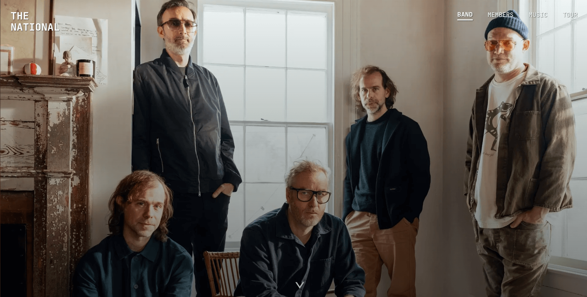
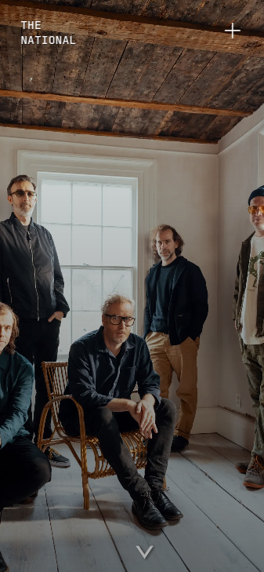
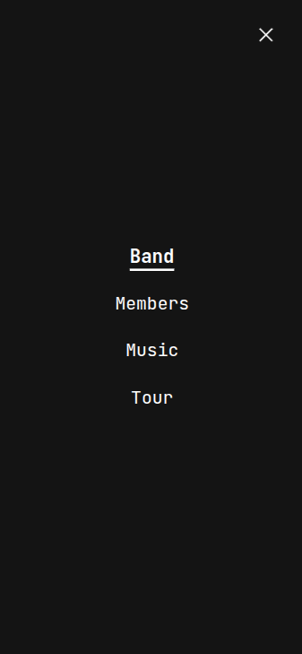
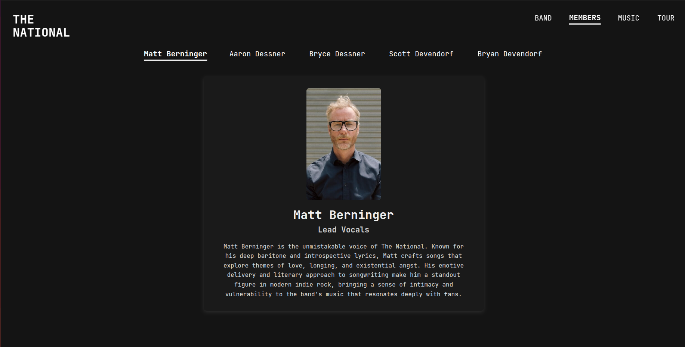
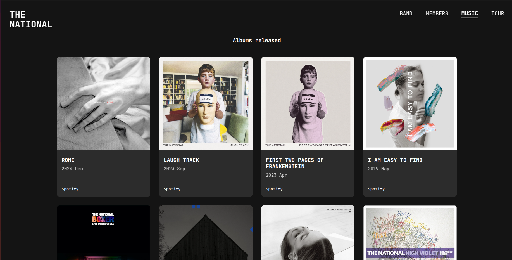
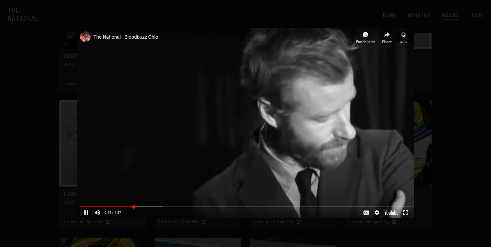

# The National Band Landing Page

This is a fan page for the band **The National**, inspired by their official website ([americanmary.com](https://www.americanmary.com/)), built with React and JavaScript.

Visit the page [here](https://the-national-landing-page-react.vercel.app/).

## Table of Contents

- [Some Context](#some-context)
- [Features](#features)
- [Tech Stack](#tech-stack)
- [What I Learned](#what-i-learned)
- [Preview](#preview)

## Some Context

This project started as a class exercise back in November 2024. The goal was to practice React Router with a simple landing page for a band of our choice, but in the moment I decided to make it about The National I couldn't stop adding more and more features. I also decided to implement animations for the first time—that was a lot of fun!

By January 2025, I made the page responsive using Tailwind CSS because I couldn’t just leave it sitting unfinished on my GitHub. It’s not a massive project—the code is actually pretty simple—but I love it so much I just had to share it with the world.

When I went back to it in January, I could see a million ways to improve my codebase. But I wanted to honor my learning process and what I was able to do back in November. So, instead of changing everything, I worked only on responsiveness. (Therefore, the code is messy and could definitely be refined.)

## Features

- **Home Page**: A big hero section with scrolling effects and a little band history.
- **Members Page**: Small profiles of each band member with animations to keep it lively.
- **Music Page**: A full album catalog pulled straight from Spotify, plus YouTube videos of my favourite tracks for each album.
- **Tour Page**: Since I couldn’t find a free API to fetch their tour dates, I redirected it to the Tour section of the band's official site. Not ideal, but possible.
- **Responsive Design**: Works on any screen size.
- **Animated UI**: Framer Motion makes everything feel smooth and polished.

## Tech Stack

- **React** for the foundation.
- **React Router** to handle page navigation.
- **CSS** for general styling.
- **Tailwind CSS** for responsive design.
- **Framer Motion** for the animations.
- **Spotify API** to get the album details and links to listen to the albums on Spotify.
- **YouTube API** for embedding videos.
- **ChatGPT** to help me with the text content on the home and members pages, as well as refine code logic.

## What I Learned

- Making React Router work.
- Adding animations with Framer Motion.
- Using APIs to fetch and manage dynamic data.
- Building responsive layouts with Tailwind CSS (and not plain CSS!)
- How much a project can grow with a bit of passion.

## Preview

#### Homepage & Menu (Mobile)

    
    

#### Members Page

#### Music Page

#### Video Preview in Music Page

#### (I know, that's enough screenshots for now.)

 

---

Created with ❤️ and React by Cátia Monteiro.
Thanks for reading!
